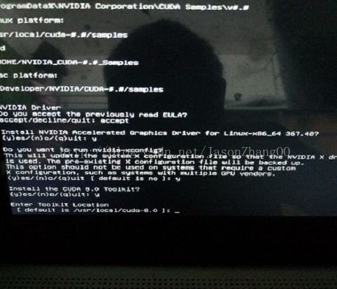

# Ubuntu踩坑日记

我是安装的双系统，所以虚拟机安装的教程就不写了

注意事项：要有坚持不懈的毅力！

首先给Ubuntu分配磁盘空间：

右键此电脑,左键点击管理，之后如图，点击

进入管理后，点击磁盘管理，选择一个你要分割出空间的磁盘，右键选中，点击压缩卷，一般分配50G就够用了，我这里分配了110G，因为我要存放一些数据，实验室大佬直接分配了500G。

分配好空间，就可以制作启动盘了，这不是我们的重点，可以问身边人要一个启动盘(装了Ubuntu正版系统的U盘)，或者自己做一个，很简单，网上教程很多。

有了启动盘之后就关闭电脑，然后插上启动盘，开机，然后疯狂按你电脑进入BIOS的键(我的hp暗影精灵3是F10，不知道的可以以自己的电脑型号为依据百度)，进入BIOS之后，找到启动顺序，选择USB启动优先，然后保存退出。

如果不出意外的话，你应该进入了启动选项，这时候用方向键上下选中Install Ubuntu，回车，就可以进入Ubuntu试用界面，有些人可能进去之后界面是旋转了九十度的，这说明显卡兼容出现了问题，出现这种情况就点击画面右上角(额。。这时候应该在左上角)，重启。在选择启动选项的时候，选中install Ubuntu，但是不要按回车，按e进入编辑模式，招到quiet slash那一行，删掉---，再按F10，就可以进入了，进入之后按照提示一步步安装，在第三步还是第四步选择正常安装，不要点图形化界面什么的，如果顺利的话，会进入安装程序，安装好了会提示你现在重启。

请注意：

> 当电脑再次启动前请务必把U盘拔下来，不然会进入无限重复安装。。。。

## 现在，你应该进入了刚安装好的热乎的Ubuntu系统

映入眼帘的，应该是800*600分辨率的极渣画质，但是这不是Ubuntu的真正面目qwq，造成这个现象的原因是没有安装适配的显卡驱动，如果你的显卡是N卡的话，不知道自己显卡是什么型号的去自己windows系统下找到系统配置看看，或者找当年买电脑的淘宝链接或账单。

现在请确保你的网络连接正常，最好网速快一点。

如果你使用锐捷校园网，请插上网线，下载了linux版本的锐捷校园网，解压缩到一个你方便找的地方，比如桌面，然后进入文件夹，找到rjsupplicant.shell文件，右键点击，选中属性，权限里开启“作为可执行文件打开”，之后授权，右键点击总文件夹，选中“在终端打开”，然后输入sudo chmod +x rjsupplicant.shell会提示你输入密码

然后sudo ./rjsu（按tab）-u xxxx(你的账号) -p xxx（你的密码）-d 1,如果成功的话最后会显示认证成功，但是现在还不能上网，因为关闭了网络管理，你需要再开一个终端，然后输入service network-manager restart重启网络管理，注意，这两个终端不要关闭，一直开着，就可以快乐的用Ubuntu系统在网上冲浪了。

然后永久禁用掉NOUVEAU驱动：

第一种方法：

ctrl+alt+t打开终端，输入find -name nouveau*

找到ko文件，改名

NOUVEAU_PATH=/lib/modules/4.15.0-29-generic/kernel/drivers/gpu/drm/nouveau
sudo mv ${NOUVEAU_PATH}/nouveau.ko ${NOUVEAU_PATH}/nouveau.ko.org

NOUVEAU_PATH=/lib/modules/4.15.0-43-generic/kernel/drivers/gpu/drm/nouveau
sudo mv ${NOUVEAU_PATH}/nouveau.ko ${NOUVEAU_PATH}/nouveau.ko.org

sudo update-initramfs -u

第二种方法，sudo vi /etc/default/grub,搜索splash，然后在其后面添加一行acpi_osi=Linux，保存退出，输入sudo update-grub2。完事

然后开始安装驱动，不然会导致驱动安装失败，我在这卡了一整天。

现在安装N卡驱动：

### 第一种 下载驱动，tty离线安装

1. 首先进入Nvidia官网，下载适合你显卡的驱动。

   Nvidia中文官网是 <http://www.nvidia.cn/page/home.html>

2. 下载好之后将该文件放于主目录（点击屏幕左侧“文件”，在页面中找到主目录，将下载好的驱动放进去）。

3. 打开终端ctrl+alt+t，先删除旧的驱动 sudo apt-get purge nvidia*

4. 禁用自带的 nouveau nvidia驱动

   创建一个文件通过命令 sudo vim /etc/modprobe.d/blacklist-nouveau.conf

   并添加如下内容：

   blacklist nouveau
   options nouveau modeset=0

   再更新一下

   sudo update-initramfs -u

   修改后重启系统。重启之后打开终端，输入lsmod | grep nouveau，如果没有任何输出，说明Nouveau已经被你干掉

5. 现在再重启一次为了进入init3(文本模式)，其实也可以用指令进入，但是我进入时出错了，为了保险就再重启一次。当进入登录界面时不要输入密码，按ctrl+alt+F1,输入你的账号密码之后，关闭X-Window，指令为：

   sudo service lightdm stop，如果提示你没有找到lightdm的话，说明你没安装，现在的图形化界面用的是gdm3 ，直接下一步就好了。在init3里，如果出现****sudo xxx(你的用户名)，这就是让你输入密码，我一开始不知道，在这卡了很久。

6. 接下来就是最关键的一步了：sudo./NV(当你输入了NV之后不妨按一下回车，会自动帮你补全文件名)IDIA-xxx.xx.run开始安装，安装过程比较快，根据提示选择，当让你选一个什么是否什么x-con什么鬼的时候选no如果选了yes可能会遇到无限频闪问题，最后安装完毕后，重新启动X-Window：sudo service lightdm start，然后Ctrl+Alt+F7进入图形界面
   

最后测试一下是否安装成功

nvidia-smi

nvidia-settings

 如果失败，建议使用第二种方法安装。

## 最简单快捷省事安全保险的显卡驱动安装方式(但是捞)

这个过程一定要保证网络连接稳定且快速

快捷键ctrl+alt+T打开命令终端，加入官方ppa源。

$ sudo add-apt-repository ppa:graphics-drivers/ppa

需要输入密码并按enter键确认。之后刷新软件库并安装最新驱动。

$ sudo apt-get update

$ sudo apt-get upgrade

然后查看自己的电脑推荐安装什么版本的显卡驱动

ubuntu-drivers dervices

然后自动安装就好了

ubuntu-drivers sutoinstall

然后就是漫长的安装过程，你可以背几个单词或者刷刷剧。

因为我们之前就修改过了grub文件，所以直接输入reboot重启就好了，如果安装成功，你将看到1920*1080分辨率的高清画质图形界面，如果还觉得不保险，打开终端输入nvidia-settings，如果弹出一个有企鹅的界面，说明安装非常成功。

安装完显卡驱动，系统可以正常使用，任务就完成了一大半了。

过几天我将安装git、qq、anaconda、tensorflow、pycharm的过程更新上来

